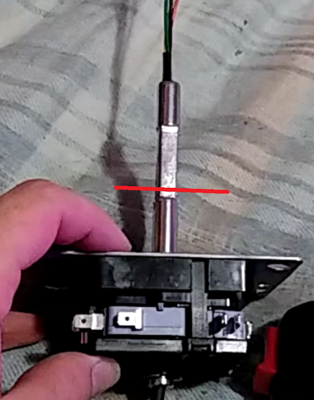

# THIS GUIDE IS INCOMPLETE BUT SHOULD GIVE YOU A GENERAL DIRECTION

The original project was missing stuff that I wanted to see in a GC controller. I modified pretty much the whole design but the spacing is still correct. I also used an arduino for this to make it work on a Nintendo Switch (currently the only supported code) and made it so you can fully take it apart for maintenance for example. 

---

# needed
- arduino pro micro
- a 3D printer
- a laser cutting machine
- 5mm acrylic
- 5mm MDF
- 9mm MDF
- 2 x chinese flight sticks
- 2 x 60mm buttons
- 2 screws for locking the top of the sticks (not manditory)
- Various bolts and nuts for securing the acrylic to the wood and the joy_base (will update later with amounts, just make sure to get long bolts for the spacers/joy_base)
- 6 x bumpon
- wood glue

# things to 3d print
- 2 x joy_stick.stl
- 2 x joy_base.stl
- 2 x joy_tube.stl

# things to laser cut
- Everything in the laser_cut_files folder (amount is specified)

# things of note
You will have to cut the flightstick shaft in other for it to fit is the joy_tube, cut it 2mm aboven the circular part (around where the red line is). You can remove the shaft by removing the ring that's on the underside.

For the inside I added a picture I still had, not the best but should give you an idea of how it will look in the end

Twisting the joy_stick on is kind of hard with this setup, you should kinda put it in on an angle and then you'll be able to twist it in. You might have to screw around with the 60mm button orientation.

Feel free to ask me questions on discord: Harvey#7954
